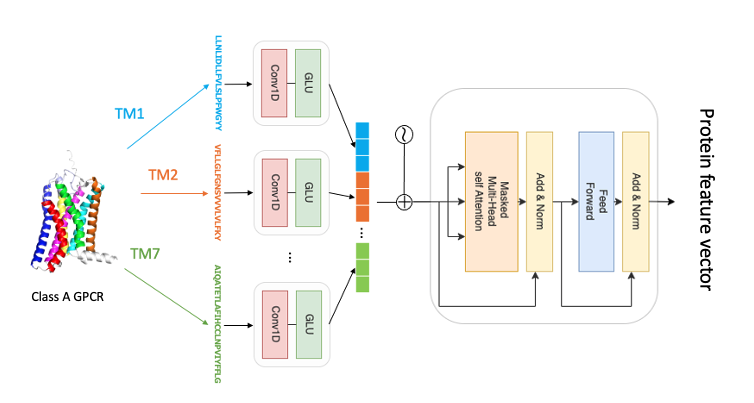
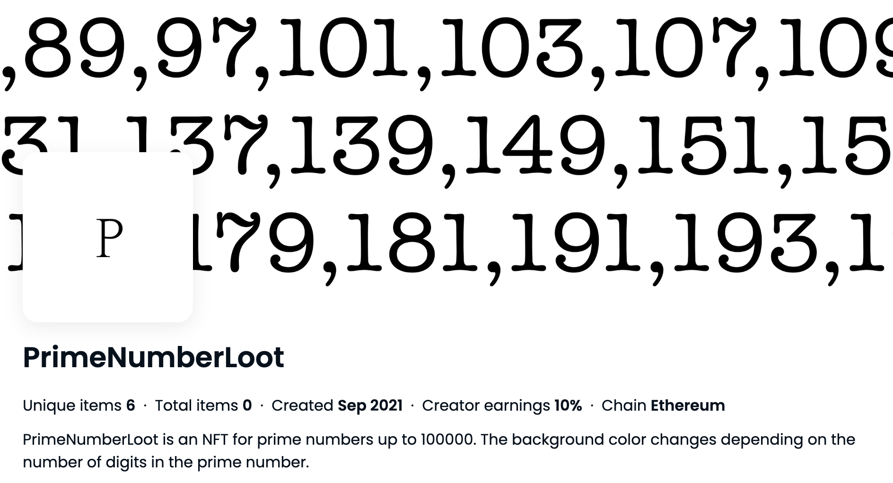

  
  

    <strong>データサイエンティスト / ブロックチェーンエンジニア</strong> 
    大学・大学院で情報工学を専攻し、現在はデータサイエンティストとして活動しております。 
    <a href="https://github.com/Haru38">GitHub</a>
  

---

## 🏛 Education / Career

  

    

    2023/10 - Present 
    <strong>LINEヤフー株式会社</strong> 
    データサイエンティスト
  

  

    

    2023/4 - 2023/9 
    <strong>ヤフー株式会社</strong> 
    データサイエンティスト
  

  

    

    2021/4 - 2023/3 
    <strong>東京工業大学大学院 情報理工学院</strong> 
    知能情報コース 修士課程 修了
  

  

    

    2017/4 - 2021/3 
    <strong>東京工業大学 情報理工学院</strong> 
    情報工学系 学士課程 卒業
  

---

## 🛠 Skills

  

    <strong style="color: #00d4ff; font-size: 1.1em;">📊 Data Science</strong> 
    <code>Python</code> <code>PyTorch</code> <code>TensorFlow</code> <code>Keras</code> <code>PySpark</code> <code>Trino</code> <code>HDFS</code> <code>Scikit-learn</code>
  

  

    <strong style="color: #00d4ff; font-size: 1.1em;">⛓️ Blockchain</strong> 
    <code>Solidity</code> <code>Web3.js</code> 
  

  

    <strong style="color: #00d4ff; font-size: 1.1em;">💻 Software & Infra</strong> 
    <code>Java</code> <code>Spring Boot</code> <code>Node.js</code> <code>Docker</code> <code>Kubernetes</code> <code>Git</code> 
  

---

## 🔬 Research

  <h3 style="margin-top:0;">Prediction of class A GPCRs and olfactory receptors activity</h3>
  
  

    Olfactory receptors are a type of G protein-coupled receptor (GPCR) that is expressed in the olfactory epithelium and closely associated with the perception of odors. To address the challenge of insufficient data for olfactory receptors, this study focused on class A GPCRs and developed a specialized protein sequence encoder called the Helix encoder. Pre-training of the activity prediction model was performed using data from class A GPCRs, followed by fine-tuning using olfactory receptor data.
  

  <h4 style="border-bottom: 1px solid rgba(255,255,255,0.2); padding-bottom: 5px;">Publications</h4>
  <ul style="font-size: 0.85em; line-height: 1.6; list-style-type: none; padding-left: 0;">
    <li>📄 Haruki Yamane and Takashi Ishida. <a href="https://doi.org/10.3389/fbinf.2023.1193025"><b>Helix encoder: a compound-protein interaction prediction model specifically designed for class A GPCRs</b></a>. Frontiers in Bioinformatics, 2023.</li>
    <li>📄 Haruki Yamane and Takashi Ishida. <a href="https://cbi-society.org/taikai/taikai22/poster_oral/p_abstract_cbi2022.pdf#page=51"><b>Prediction of class A GPCR-Compound interactions by deep learning</b></a>. CBI Annual Meeting 2022.</li>
    <li>📄 山根 永暉, 石田 貴士. <a href="https://ipsj.ixsq.nii.ac.jp/ej/?action=pages_view_main&active_action=repository_view_main_item_detail&item_id=216913&item_no=1&page_id=13&block_id=8"><b>クラスA GPCR専用エンコーダを用いた相互作用予測</b></a>. 第69回SIGBIO研究会.</li>
  </ul>

---

## 💼 Experience (Interns & Works)

  

    

    2022/6 - 2023/3 
    <strong style="font-size: 1.1em;"><a href="https://www.platinum-egg.com/">株式会社プラチナエッグ</a></strong> 
    Blockchain Engineer (Intern)
    
複数のブロックチェーンゲーム開発プロジェクトに参画。ERC721、ERC20を中心にスマートコントラクトの開発に従事。

  

  

    

    2021/10 
    <strong style="font-size: 1.1em;">ヤフー株式会社</strong> 
    Data Scientist (Intern)
    
検索システムにおけるサジェスト機能に使用されるリランキングモデルの開発に従事。

  

  

    

    2021/9 - 2022/2 
    <strong style="font-size: 1.1em;"><a href="https://leadedge-c.com/">株式会社リードエッジコンサルティング</a></strong> 
    Blockchain Engineer (Intern)
    
NFTのサブスクサービスにおけるスマートコントラクトの開発や、MaticのFaucetを含むweb3ツールの開発に従事。

  

  

    

    2019/4 - 2021/3 
    <strong style="font-size: 1.1em;"><a href="https://sciseed.jp/">株式会社サイシード</a></strong> 
    Software Engineer (Intern)
    
電光掲示板に表示される3Dキャラクターを用いた警備システムの開発。物体認識及びトラッキングモデルの開発に従事。

  

---

## 🚀 Projects

  
  

    <h3 style="margin-top:0;">PrimeNumberLoot</h3>
    <ul style="font-size: 0.95em; margin-top: 0; line-height: 1.8;">
      <li>独自スマートコントラクトを構築し、Ethereumにてデプロイを行いました。</li>
      <li><a href="https://opensea.io/collection/primenumberloot">OpenSea Page</a> / <a href="https://github.com/Haru38/PrimeNumberLoot">Github</a></li>
    </ul>
  

